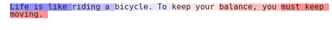

# pylighter
Simple, score-based text highlighting for Python

Example usage:

```
import pylighter as pl
from numpy import linspace

tokens = 'Life is like riding a bicycle. To keep your balance, you must keep moving.'.split()
scores = linspace(0, 1, len(tokens))

fig, ax = pl.render(tokens, scores)
```

Renders:



See `pylighter/examples.ipynb` for additional examples.
